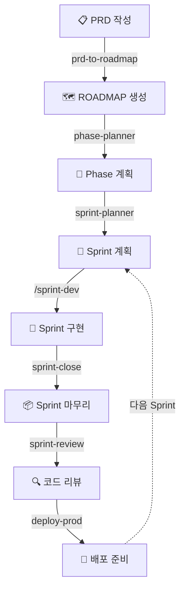
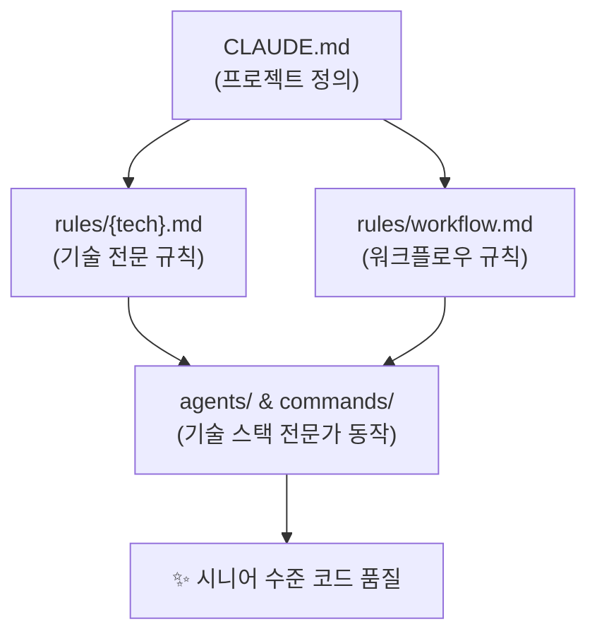

# .claude/ — AI 개발 프레임워크

**Claude Code 전용 | 기술 스택 무관 | 프로젝트 간 재사용**

어떤 기술 스택의 프로젝트든 이 폴더를 복사하면 **즉시 체계적인 AI 기반 개발 환경**이 구축됩니다.
프로젝트를 진행할수록 규칙과 에이전트가 축적되어 **프레임워크 자체가 성장**합니다.

> **핵심 가치**: 복사 한 번으로 시니어 수준의 코드 품질 + 자동화된 개발 워크플로우

---

## 목차

- [Quick Start](#-quick-start)
- [개발 사이클](#-개발-사이클)
- [폴더 구조](#-폴더-구조)
- [핵심 동작 원리](#-핵심-동작-원리)
- [기술 스택 규칙](#-기술-스택-규칙)
- [에이전트 & 커맨드](#-에이전트--커맨드)
- [CLAUDE.md 템플릿](#-claudemd-템플릿)
- [범용성 확장](#-범용성-확장)

---

## 🚀 Quick Start

### 1. 복사

```bash
cp -r {기존프로젝트}/.claude/ {새프로젝트}/.claude/
```

### 2. CLAUDE.md 작성

프로젝트 루트에 `/CLAUDE.md`를 작성합니다. ([템플릿 보기](#-claudemd-템플릿))
**이 파일이 전체 시스템의 핵심** — 모든 에이전트와 규칙이 이 파일을 읽고 동작합니다.

### 3. 프로젝트 종속 데이터 초기화

이전 프로젝트에서 복사했다면 아래 항목을 정리합니다:

| 구분 | 파일/폴더 | 조치 |
|:----:|-----------|------|
| 🔄 | `agent-memory/**` | **초기화** — 이전 프로젝트 상태 리셋 |
| 🔄 | `settings.local.json` | **확인** — 이전 권한/토큰 제거 |
| ✅ | `rules/`, `agents/`, `commands/` | 유지 — 범용 |
| ✅ | `memory/user_*.md`, `memory/feedback_*.md` | 유지 — 사용자 선호 |

> **Tip**: Claude에게 "새 프로젝트 시작할 거야"라고 말하면 자동으로 정리를 제안합니다.

### 4. 기술 스택 규칙 확인

CLAUDE.md에 명시한 기술 스택의 `rules/{tech}.md`가 있는지 확인합니다.
없으면 Claude에게 생성을 요청하세요 — [TEMPLATE.md](rules/TEMPLATE.md) 기반으로 시니어 수준 규칙을 자동 생성합니다.

### 5. 개발 시작!

---

## 🔄 개발 사이클



| 단계 | 에이전트/커맨드 | 산출물 |
|:----:|:-------------:|--------|
| 0 | `project-init` | CLAUDE.md + rules/{tech}.md |
| 1 | `prd-to-roadmap` | ROADMAP.md |
| 2 | `phase-planner` | docs/phase/phase{N}.md |
| 3 | `sprint-planner` | docs/sprint/sprint{N}.md |
| 4 | `/sprint-dev {N}` | 구현 코드 + 커밋 |
| 5 | `sprint-close` | develop PR + 문서 정리 |
| 6 | `sprint-review` | 코드 리뷰 + 검증 결과 |
| 7 | `deploy-prod` | 릴리즈 빌드 + 배포 준비 |

---

## 📁 폴더 구조

```
.claude/
│
├── 📄 README.md                     이 파일
├── ⚙️ settings.json                 Claude Code 권한 설정 (공유)
├── ⚙️ settings.local.json           로컬 전용 설정 (환경별, git 제외)
│
├── 📏 rules/                        규칙 라이브러리
│   ├── TEMPLATE.md                    rules 작성 메타 템플릿
│   ├── session-init.md                세션 컨텍스트 로딩 규칙
│   ├── prd-guide.md                   PRD 작성 품질 가이드
│   ├── sprint-workflow.md             스프린트/핫픽스 워크플로우
│   ├── notion.md                      Notion 문서 작성 가이드
│   ├── typescript.md                  TypeScript 베스트 프랙티스
│   ├── react-native.md                React Native + Expo
│   ├── supabase.md                    Supabase
│   ├── csharp.md                      C#
│   └── {tech}.md                      (프로젝트 진행하며 확장)
│
├── 🤖 agents/                       자동화 에이전트 (8개)
│   ├── project-init.md                새 프로젝트 초기 설정
│   ├── prd-to-roadmap.md              PRD → ROADMAP 변환
│   ├── phase-planner.md               Phase 상세 계획
│   ├── sprint-planner.md              Sprint 실행 명세서
│   ├── sprint-close.md                Sprint 마무리 (PR + 문서)
│   ├── sprint-review.md               코드 리뷰 + 검증
│   ├── hotfix-close.md                Hotfix 마무리
│   └── deploy-prod.md                 배포 준비
│
├── ⌨️ commands/                      사용자 실행 커맨드
│   └── sprint-dev.md                  /sprint-dev {N}
│
├── 🧠 memory/                       사용자 선호 (범용, 프로젝트 간 재사용)
│   ├── MEMORY.md                      메모리 인덱스
│   ├── user_*.md                      사용자 프로필
│   └── feedback_*.md                  작업 방식 피드백
│
└── 💾 agent-memory/                  에이전트 메모리 (프로젝트 종속)
    ├── phase-planner/MEMORY.md        ⚠️ 새 프로젝트 시 리셋
    ├── prd-to-roadmap/MEMORY.md
    ├── sprint-planner/MEMORY.md
    └── sprint-review/MEMORY.md
```

> **`memory/` vs `agent-memory/`**
>
> | | `memory/` | `agent-memory/` |
> |---|---|---|
> | **성격** | 사용자 작업 스타일, 선호도 | 에이전트의 프로젝트 진행 기록 |
> | **범위** | 프로젝트 무관 (범용) | 프로젝트 종속 |
> | **새 프로젝트** | 그대로 유지 | 리셋 필수 |

---

## ⚡ 핵심 동작 원리



1. **CLAUDE.md 읽기** → 기술 스택, 빌드 명령, 구조 파악
2. **rules/ 로드** → 해당 기술 스택의 시니어 수준 규칙 확보
3. **전문가로 동작** → 코드 리뷰, 빌드 검증, 품질 기준 모두 기술 특화

---

## 📏 기술 스택 규칙

규칙 파일은 **워크플로우 규칙**과 **기술 전문 규칙** 두 종류입니다.

### 워크플로우 규칙 (기술 무관)

| 파일 | 용도 | 로딩 시점 |
|------|------|----------|
| [session-init.md](rules/session-init.md) | 세션 시작 시 컨텍스트 로딩 | 매 세션 |
| [sprint-workflow.md](rules/sprint-workflow.md) | 스프린트/핫픽스 프로세스 | Sprint 작업 시 |
| [prd-guide.md](rules/prd-guide.md) | PRD 작성 품질 기준 | PRD 작성/검토 시 |
| [notion.md](rules/notion.md) | Notion 문서 작성 가이드 | 문서 정리 시 |
| [TEMPLATE.md](rules/TEMPLATE.md) | rules 파일 작성 메타 템플릿 | 새 규칙 생성 시 |

### 기술 전문 규칙 (제공됨)

| 기술 스택 | 파일 | 점수 |
|----------|------|:----:|
| TypeScript | [typescript.md](rules/typescript.md) | 72 |
| React Native + Expo | [react-native.md](rules/react-native.md) | 85 |
| Supabase | [supabase.md](rules/supabase.md) | 88 |
| C# | [csharp.md](rules/csharp.md) | 85 |

> 점수는 [TEMPLATE.md](rules/TEMPLATE.md)의 4단계 품질 체크리스트 기준 (Level 1: 60 ~ Level 4: 95+)
> 프로젝트 진행하면서 점진적으로 개선됩니다.

### 새 기술 스택 추가

```
1. Claude에게 "rules/{tech}.md 만들어줘" 요청
2. TEMPLATE.md 기반으로 시니어 수준 규칙 자동 생성
3. 프로젝트 진행하면서 실전 함정/패턴 축적
4. 다른 프로젝트에서도 그대로 재사용
```

---

## 🤖 에이전트 & 커맨드

### 에이전트 (자동화)

| 에이전트 | 역할 | 트리거 |
|---------|------|--------|
| **project-init** | 기술 스택 결정 + CLAUDE.md + rules 생성 | 새 프로젝트 시작 |
| **prd-to-roadmap** | PRD 분석 → ROADMAP.md 생성 | PRD 작성 완료 |
| **phase-planner** | Phase 상세 계획 + 전문가 병렬 리뷰 | 대규모 기능 계획 |
| **sprint-planner** | Sprint 실행 명세서 생성 | Sprint 시작 전 |
| **sprint-close** | ROADMAP 업데이트 + PR 생성 + 문서 정리 | Sprint 구현 완료 |
| **sprint-review** | 2계층 코드 리뷰 + 빌드 검증 | PR 리뷰 시 |
| **hotfix-close** | Hotfix PR + 경량 리뷰 + deploy.md 기록 | Hotfix 완료 |
| **deploy-prod** | 릴리즈 빌드 + 배포 가이드 + 릴리즈 노트 | QA 통과 후 |

### 커맨드 (사용자 실행)

| 커맨드 | 용도 |
|--------|------|
| `/sprint-dev {N}` | sprint{N}.md를 읽고 Task별로 구현 실행 |

---

## 📝 CLAUDE.md 템플릿

프로젝트 루트에 `/CLAUDE.md`를 작성할 때 아래 템플릿을 복사하여 수정합니다:

````markdown
# {프로젝트명}

## 프로젝트 개요
- 목적: {한 줄 설명}
- 유형: {웹 앱 / 데스크톱 앱 / API 서버 / 라이브러리 / CLI 도구 등}

## 기술 스택
- 언어: {예: TypeScript, Python, C# 등}
- 프레임워크: {예: React, FastAPI, .NET 8 등}
- 런타임: {예: Node.js 20, Python 3.12, .NET 8 등}
- 패키지 관리: {예: npm, pip, NuGet 등}
- 데이터베이스: {예: PostgreSQL, MongoDB, SQLite 등} (해당 시)
- 주요 라이브러리: {프로젝트 핵심 의존성 목록}

## 프로젝트 구조
```
{project-root}/
├── src/              # 소스 코드
├── tests/            # 테스트
├── docs/             # 문서
│   ├── sprint/       # 스프린트 명세서
│   └── phase/        # Phase 계획서
├── CLAUDE.md         # 이 파일
├── ROADMAP.md        # 로드맵
└── deploy.md         # 배포 기록
```

## 빌드 & 실행

### 빌드
```bash
{프로젝트 빌드 명령}
```

### 개발 서버
```bash
{개발 서버 실행 명령}
```

### 테스트
```bash
{테스트 실행 명령}
```

### 린트/포맷
```bash
{린트, 포맷팅 명령}
```

## 브랜치 전략
- 메인 브랜치: `main` (또는 `master`)
- 개발 브랜치: `develop`
- 작업 브랜치: `sprint{N}` / `feature/*` / `hotfix/*` → develop으로 PR

## CI/CD
{CI/CD 파이프라인 설명}

## 배포
{배포 환경 및 절차}

## 코드 컨벤션
- {프로젝트 고유 네이밍 규칙}
- {커밋 메시지 형식}

## 외부 연동 (해당 시)
- {API, 서비스 연동 정보}

## Notion 연동 (해당 시)
- 루트 페이지: {URL}
- Integration 토큰: 환경 변수 `NOTION_TOKEN`으로 관리
- 하위 페이지 ID: {각 페이지별 ID}
````

---

## 🔧 settings.json 권한 설정

기본 설정에는 `cd`와 `git`만 허용되어 있습니다. 프로젝트에 맞게 추가하세요:

```json
{
  "permissions": {
    "allow": [
      "Bash(cd *:*)",
      "Bash(git *)",
      "Bash(npm *)",
      "Bash(npx *)",
      "Bash(python *)",
      "Bash(dotnet *)"
    ]
  }
}
```

> 필요한 명령만 추가. 불필요한 권한은 보안상 제거 권장.

---

## 🌱 범용성 확장

이 프레임워크는 프로젝트를 진행할수록 강해집니다.

```
📦 새 기술 스택       →  rules/{tech}.md 생성  →  다음 프로젝트에서 재사용
🔧 워크플로우 개선     →  agents/ 수정         →  모든 프로젝트에 즉시 적용
🤖 반복 작업 발견      →  agents/{name}.md 추가 →  자동화 확대
📋 실전 함정 발견      →  rules에 추가          →  같은 실수 반복 방지
```

> `.claude/` 폴더가 git에 포함되어 있으므로,
> 가장 활발한 프로젝트에서 개선한 뒤 다른 프로젝트로 복사하여 동기화합니다.

---

## 📄 프로젝트 문서 구성

| 문서 | 용도 | 생성 방법 |
|------|------|----------|
| `CLAUDE.md` | 프로젝트 정의 (기술 스택, 빌드, 구조) | 수동 작성 |
| `ROADMAP.md` | Phase/Sprint 전체 로드맵 | `prd-to-roadmap` 에이전트 |
| `docs/prd.md` | 요구사항 정의서 | 수동 작성 ([가이드](rules/prd-guide.md)) |
| `docs/phase/phase{N}.md` | Phase 상세 계획 | `phase-planner` 에이전트 |
| `docs/sprint/sprint{N}.md` | Sprint 실행 명세 | `sprint-planner` 에이전트 |
| `deploy.md` | 배포 기록 및 검증 결과 | 자동 생성 |
